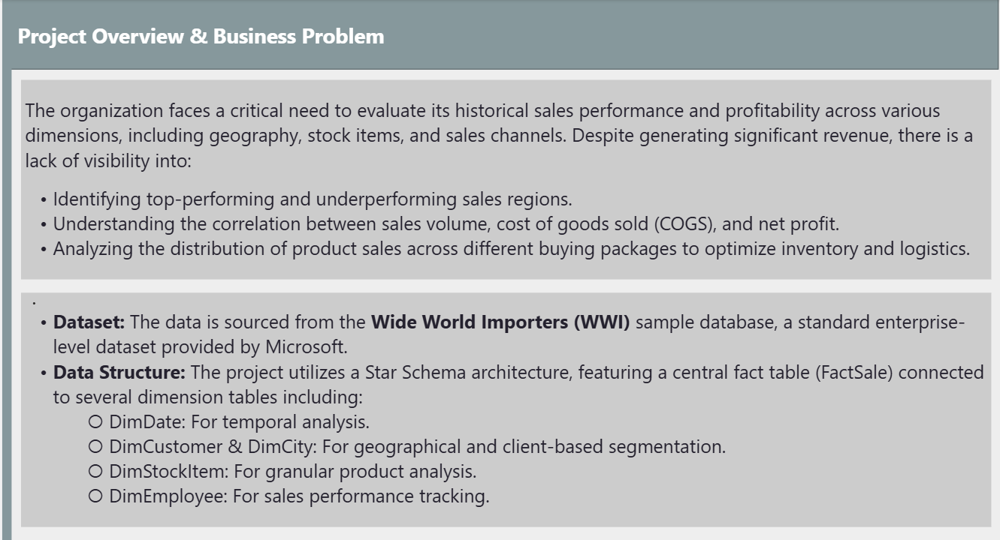
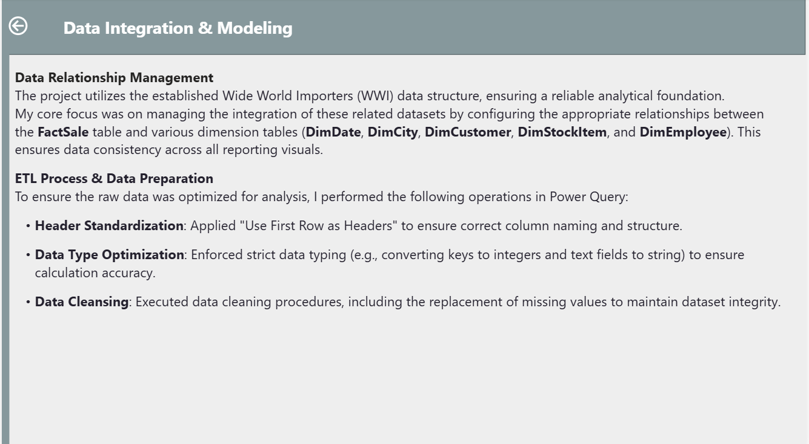
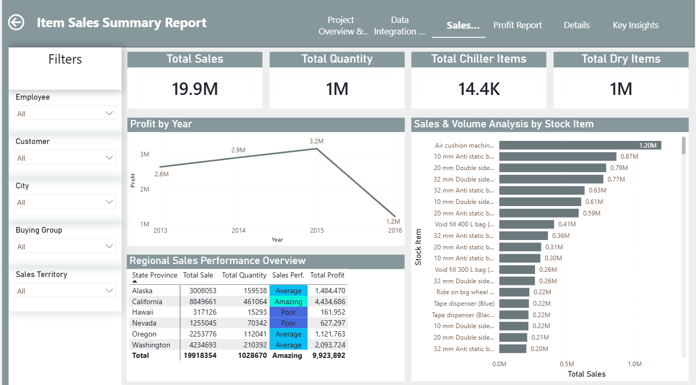
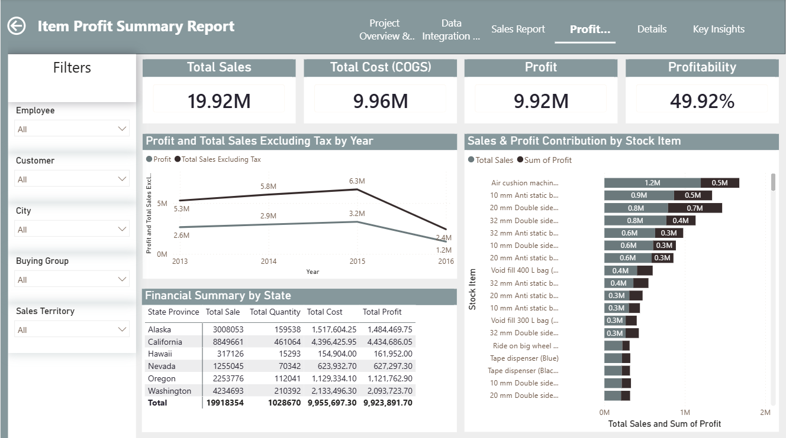
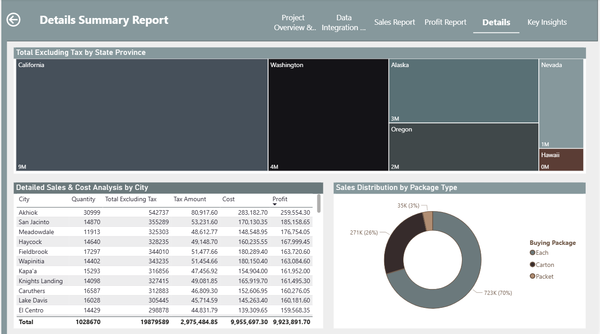
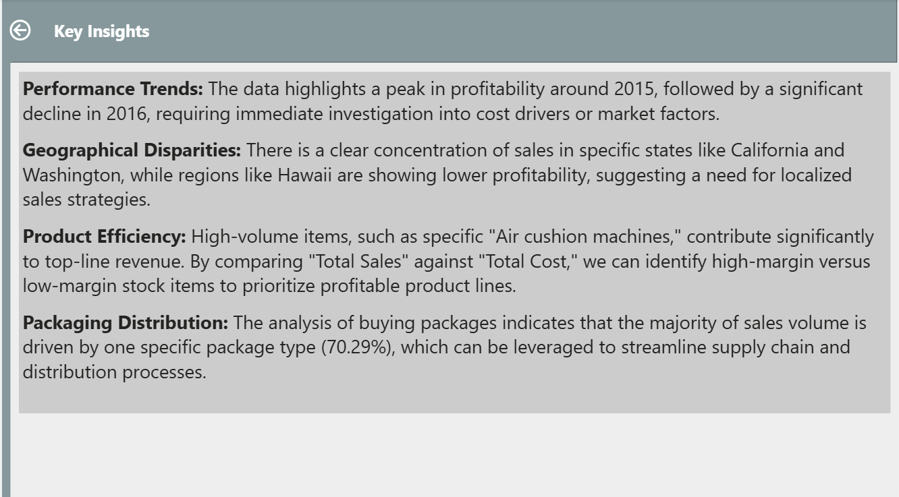

# WWI-Comprehensive-Sales-Profitability-Analysis
# Wide World Importers: Sales Performance & Financial Analysis

## Business Problem
The organization faced a critical challenge: raw, fragmented enterprise data that lacked actionable visibility. Specifically:
* **Lack of Performance Visibility**: Unable to distinguish between high-performing and underperforming sales regions, hindering strategic resource allocation.
* **Profitability Blind Spots**: No clear correlation between sales volume and net profit, leading to unidentified cost drivers and margin erosion.
* **Operational Inefficiency**: Ineffective analysis of inventory and buying packages, complicating supply chain and distribution management.

*Project_Overview&Business_Problem*

## The Solution
I engineered an end-to-end analytical solution to transform this data into a strategic asset:
* **Data Integration & Modeling**: Configured a robust Star Schema, establishing a "single source of truth" by linking the central `FactSale` table to key dimension tables (`DimDate`, `DimCity`, `DimCustomer`, `DimStockItem`, `DimEmployee`).
* **ETL Pipeline**: Built an automated Power Query pipeline to standardize headers, enforce strict data typing for calculation accuracy, and perform proactive data cleansing (handling missing values).

*Overview of the data modeling and the ETL transformation steps.*

---

## Analytical Dashboards
The solution comprises a three-tiered reporting system designed for deep-dive analysis:

### 1. Sales Performance Report
Focuses on top-line revenue, volume metrics, and regional performance benchmarks to guide sales strategy.

*Visualizing total sales, volume, and regional performance benchmarks.*

### 2. Profit & Financial Report
Bridges the gap between revenue and cost, highlighting profit margins and financial health per product line.

*Analysis of cost-to-profit correlations for individual stock items.*

### 3. Details & Distribution Analysis
Provides granular city-level analytics and examines the impact of buying packages on distribution efficiency.

*Deep-dive analytics into city-level performance and supply chain trends.*

---

## Key Insights
The project revealed critical strategic findings that directly support data-driven decision-making:
* **Profitability Trends**: Identified a profit peak in 2015 followed by a decline in 2016, highlighting the need for immediate cost structure review.
* **Regional Disparities**: Highlighted California and Washington as primary revenue drivers, while identifying Hawaii as an area requiring localized sales intervention.
* **Product Efficiency**: Correlated sales volume with COGS to prioritize high-margin stock items.
* **Logistics Optimization**: Discovered that one specific buying package drives 70.29% of volume, providing a clear target to streamline distribution processes.

*Summary of key findings and actionable business recommendations.*

## Technical Skills Demonstrated
* **Data Engineering**: ETL pipeline design, data cleaning, and relationship management.
* **Business Intelligence**: Converting enterprise raw data into strategic, actionable dashboards.
* **Analytical Thinking**: Translating complex financial data into clear business insights.

---
